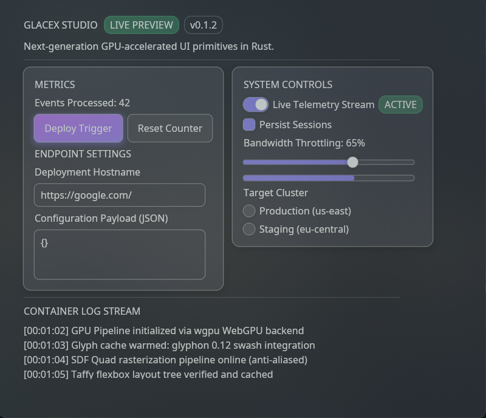

# glacex

GPU-Rendered UI library — built from scratch in Rust [WIP]
Built by Artem Tsitronov and Soumalya Das.

## About

glacex is a GPU-accelerated, immediate-mode UI library built entirely 
from scratch using `winit` and `wgpu`, with no dependency on existing 
UI frameworks. Currently in early development.

## Status

⚠️ This project is under active development and not yet ready for 
production use. APIs are unstable and subject to change.

## Features (so far)

- Instanced GPU rendering
- SDF rounded-corner shapes
- Text rendering via `glyphon`
- Hit-testing and interaction system
- Layout system (Row/Column/Container) via taffy
- A filling system (Solid, Gradient)
- Widgets: button, checkbox, radio button, label, text input, 
  text area, scroll view, container, card, badge, divider, 
  progress bar, switch, slider,
- Theme system and modern default design
- Customizability via styling
