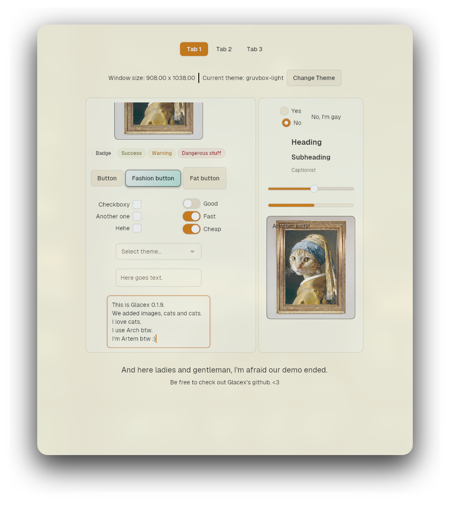

<div align="center">



# glacex

<p align="center">
  <a href="https://crates.io/crates/glacex"></a>
  <a href="https://docs.rs/glacex"></a>
  <a href="https://github.com/artemtsitronov/glacex/blob/main/LICENSE"></a>
  
  
  <a href="https://github.com/artemtsitronov/glacex/stargazers"></a>
</p>

a gpu-rendered, immediate-mode ui library for rust.

built from scratch with `wgpu`, `winit`, `taffy`, and `glyphon`.

**by artem tsitronov and soumalya das**

</div>

> [!warning]
> glacex is experimental. the api can change between 0.x releases. pin your dependencies if you value a quiet afternoon.

## what is this?

glacex lets you build desktop apps in rust. no browser. no electron. no 200mb "hello world". no xml layout files from 2009.

you describe your interface in plain rust, once per frame. glacex handles the layout, the input, the animations, and the part where pixels appear on screen:

* **`wgpu`** draws everything on the gpu (shapes are evaluated from signed-distance functions in a shader, so corners stay crisp at any size).
* **`winit`** owns the window and the event loop.
* **`taffy`** does flexbox layout, so you don't have to do math before coffee.
* **`glyphon`** draws the text.
* **`kurbo`** draws the curvy bits (bezier paths).

there is no retained widget tree to keep in sync and no markup language to learn. if you can write a function, you can write a ui. that is the whole pitch.

## installation

from crates.io:

```bash
cargo add glacex
```

or in `Cargo.toml`:

```toml
[dependencies]
glacex = "0.1.95"
```

latest development version:

```toml
[dependencies]
glacex = { git = "https://github.com/artemtsitronov/glacex.git", branch = "main" }
```

requirements: rust 1.85+, a gpu backend `wgpu` supports, and (on linux) a running wayland or x11 session.

### linux dependencies

install the development packages for your distribution:

<details>
<summary>debian / ubuntu</summary>

```bash
sudo apt install libx11-dev libxcursor-dev libxrandr-dev libxi-dev libxkbcommon-dev libwayland-dev
```

</details>

<details>
<summary>fedora</summary>

```bash
sudo dnf install libX11-devel libXcursor-devel libXrandr-devel libXi-devel libxkbcommon-devel wayland-devel
```

</details>

<details>
<summary>arch linux</summary>

```bash
sudo pacman -S libx11 libxcursor libxrandr libxi libxkbcommon wayland
```

</details>

## your first app in 60 seconds

a counter. every ui library must prove it can count to two, it's the law.

```rust
use glacex::{App, Button, Label, Theme, Ui, Widget, column};

struct Counter {
    count: u32,
}

impl Widget for Counter {
    type Output = ();

    fn ui(&mut self, ui: &mut Ui) {
        // background color. pick your fighter.
        ui.set_bgcolor(Theme::BG_CANVAS);

        // 1. build widgets (plain structs, nothing scary)
        let mut label = Label::new(format!("count: {}", self.count));
        let mut button = Button::new("increment").id("increment-button");

        // 2. lay them out (a vertical stack, placed at x=40, y=40)
        column![&mut label, &mut button]
            .spacing(12.0)
            .arrange_at([40.0, 40.0], ui);

        // 3. react (AFTER layout -- the button knows if it was clicked now)
        if button.clicked() {
            self.count += 1;
        }
    }
}

fn main() {
    App::new(Counter { count: 0 }).run();
}
```

that is the entire framework, conceptually:

1. **build** widgets every frame (they're cheap structs, not precious objects).
2. **lay out** with `column!` / `row!`, then `arrange_at(position, ui)`.
3. **react** to what happened (`clicked()`, `text(ui)`, `value(ui)`...).

state (checkbox on/off, text field contents, slider position) lives inside `Ui`, keyed by each widget's id -- not in your structs. your structs just describe; `Ui` remembers. [how ids and state work →](docs/getting-started.md#the-only-rule-that-matters-give-stateful-widgets-stable-ids)

new here? read the **[getting started guide](docs/getting-started.md)** next. it explains the frame loop, ids, and layout without assuming you know what "immediate mode" means (spoiler: it just means "redraw everything every frame and stop worrying").

## the widgets

### controls (things you poke)

| widget        | what it is                                    |
| ------------- | --------------------------------------------- |
| `Button`      | clickable. `.primary()`, `.outline()`, `.ghost()`, `.danger()` |
| `Checkbox`    | boolean tick box with an animated checkmark   |
| `RadioButton` | pick-one-of-many, grouped by a shared id     |
| `Switch`      | on/off toggle with a sliding knob             |
| `Slider`      | drag a number between min and max             |
| `TextInput`   | single-line text field (selection, clipboard, the works) |
| `TextArea`    | multi-line editor with its own scrollbar      |
| `SelectBox`   | dropdown with optional type-to-filter search  |
| `Tabs`        | tab strip with a sliding selection pill       |

```rust
let mut deploy = Button::new("deploy").id("deploy").primary();

if deploy.clicked() {
    println!("deployed. probably fine.");
}
```

every widget follows the same recipe: `Thing::new(...)` → chain builders (`.id()`, `.size()`, `.style()`, ...) → put it in a layout → ask it what happened. full menu with every builder method: **[widget reference](docs/widgets.md)**.

### containers (things that hold other things)

| widget       | what it is                              |
| ------------ | --------------------------------------- |
| `Card`       | padded panel. `.subtle()`, `.elevated()` |
| `ScrollView` | scrollable box with auto-hiding scrollbar |
| `Container`  | fixed-size wrapper with padding          |
| `Divider`    | a line. `horizontal(len)` / `vertical(len)`, `.faint()` |

### displays (things you look at)

| widget        | what it is                              |
| ------------- | --------------------------------------- |
| `Label`       | text. `.heading()`, `.caption()`, `.mono()`, colors... |
| `Badge`       | little status pill. `.success()`, `.warning()`, `.error()` |
| `ProgressBar` | bar that fills up. takes `0.0..=1.0`    |

## themes (nine of them, zero effort)

```rust
ui.set_theme(Theme::DARK);             // one line. whole app repaints.
```

| name | vibe |
| ---- | ---- |
| `Theme::LIGHT` / `Theme::DARK` | the classics |
| `Theme::CATPPUCCIN_MOCHA` / `Theme::CATPPUCCIN_LATTE` | pastel, beloved by dotfile enthusiasts |
| `Theme::TOKYO_NIGHT` | neon city at 2am |
| `Theme::GRUVBOX_DARK` / `Theme::GRUVBOX_LIGHT` | retro groove, warm like toast |
| `Theme::NORD` | arctic, calm, slightly cold |
| `Theme::ROSE_PINE` | soft and rosy, as advertised |

`Theme::all()` returns all nine, so a theme switcher is about five lines. see [`examples/themes.rs`](examples/themes.rs). custom styles, gradients, and image fills: **[styling guide](docs/themes-and-styling.md)**.

## examples

```bash
cargo run --example example1    # start here: tiny, commented, one card
cargo run --example reminder    # a real todo app + how to write your own widget
cargo run --example free_shape  # custom bezier shapes, zero layout
cargo run --example themes      # all 9 themes, every widget, one window
cargo run --example example2    # live style playground (type CSS-ish, see pixels)
cargo run --example demo        # the kitchen sink
```

every example is heavily commented and reads top-to-bottom. `example1` is the smallest; start there.

## layout in one paragraph

`column![a, b, c]` stacks vertically, `row![a, b]` lines up horizontally. chain `.spacing()`, `.align()`, `.padding()`, `.size()` -- then finish with `.arrange_at([x, y], ui)` to actually place it. layouts nest: rows in columns in cards in scroll views. that's it, that's flexbox. details: **[layout guide](docs/layout.md)**.

## accessibility

opt-in, one line:

```rust
App::new(root_widget)
    .accessibility_enabled(true)
    .run();
```

exposes widgets to screen readers via `accesskit` (at-spi on linux, native apis elsewhere).

## known limitations

glacex is still under development. some corners are, in fact, still corners.

* mesh gradients are not implemented and currently render transparent.
* image fills support only one image at a time (single shared atlas, no eviction yet).
* free (bezier) paths don't support image fills, shadows, holes, or reliable self-intersections.
* free paths render after regular shapes, so paint order can't interleave with rects/ellipses yet.
* the api may change between releases. it's 0.x. you knew what this was.

## documentation

* [getting started](docs/getting-started.md) -- your first app, the frame loop, ids
* [widget reference](docs/widgets.md) -- every widget, every builder
* [layout guide](docs/layout.md) -- rows, columns, sizing
* [themes & styling](docs/themes-and-styling.md) -- themes, styles, color, gradients
* [custom widgets](docs/custom-widgets.md) -- build your own from scratch
* [architecture](docs/architecture.md) -- how the gpu sausage is made
* [api docs on docs.rs](https://docs.rs/glacex)
* [contributing](CONTRIBUTING.md)

## contributing

bug reports, testing, and pull requests are welcome.

please read [CONTRIBUTING.md](CONTRIBUTING.md) first. small, focused changes are easier to review and less likely to summon the debugger.

## forks

experimental fork by [soumalya das](https://github.com/programmersd21/glacex).

the fork may contain independent changes, redesigns, and ai-assisted contributions. these are not maintained or endorsed by artem tsitronov. check the fork's own history and documentation for its current state.

## license

mit. see [LICENSE](LICENSE).

copyright (c) 2026 artem tsitronov and glacex contributors.

---

if glacex is useful to you, consider starring the repository, trying it in a project, or reporting a bug. testing an experimental ui library is a great way to discover how many ways a button can misbehave.

thanks for giving it a look.
